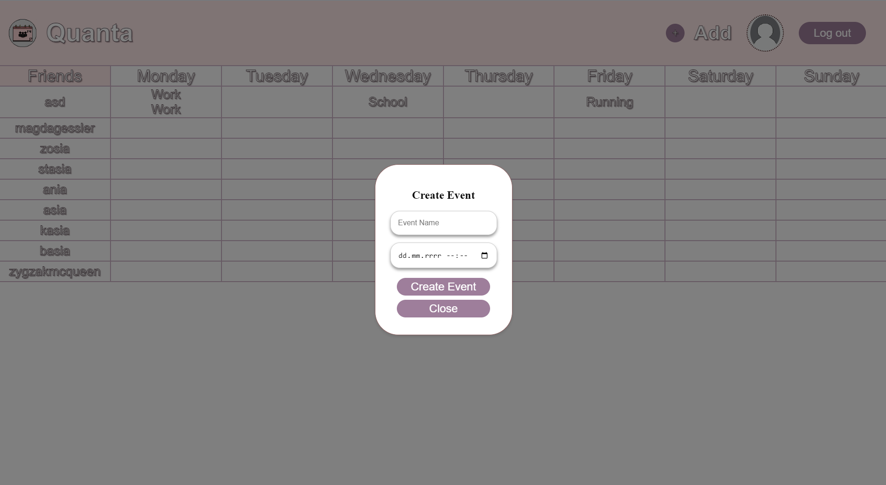
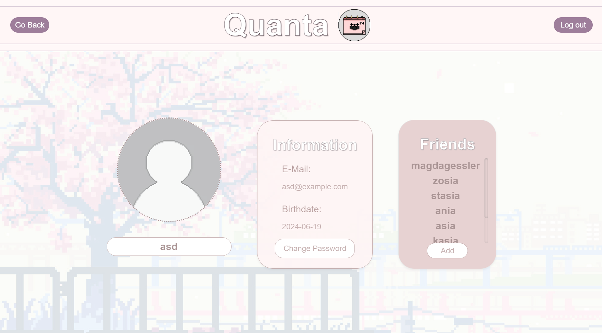
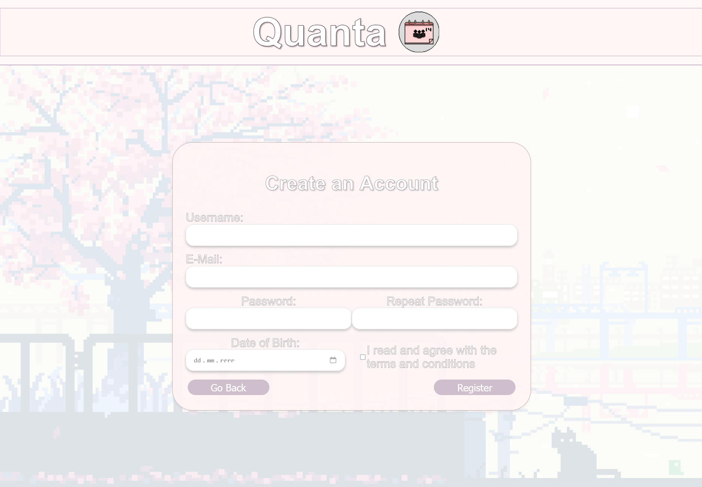
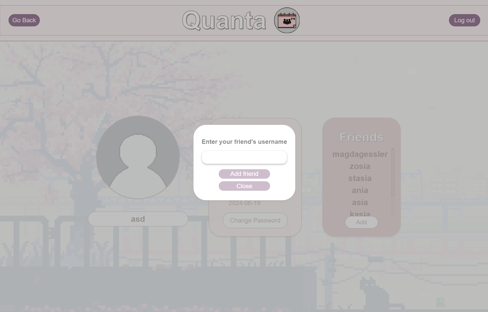
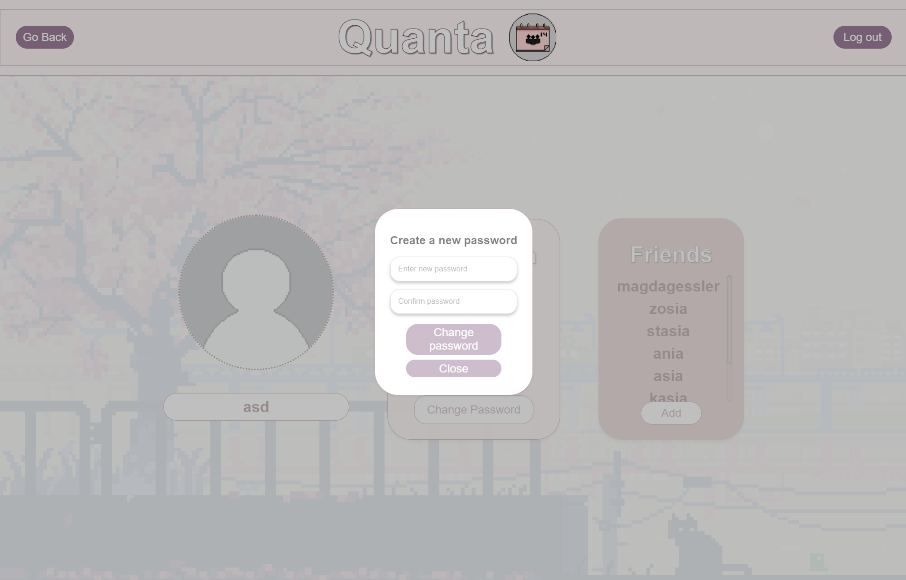

# Quanta

## About

Quanta is a time management web application meant to use with friends. Its main purpose is to effciently help users find time for their friends and family by comparing schedules.




## Implemented Features

- Account creation



- Event creation
- Calendar overview
- Adding friends



- Changing password



## Technologies

- [Nuxt3](https://nuxt.com)
- [Vue.js](https://vuejs.org)
- [FastAPI](https://fastapi.tiangolo.com)
- [PostgreSQL](https://www.postgresql.org)
- [Docker](https://www.docker.com)

## Setup

Quanta is currently only available to run by yourself on localhost.

1. Clone the repository
```
git clone https://github.com/koteczki01/time_management_web_app
```
2. Enter the API directory
```
cd backend\rest_api_service
```
3. Run the API
```
python3 -m uvicorn main:app --host 0.0.0.0 --port 8000
```
4. In a new terminal enter the frontend directory
```
cd frontend
```
5. Run the frontend
```
npm run dev
```
6. Open `localhost:3000` in your browser

## Team

| Project Manager |
| :-------------: |
| [Sara Stec](https://github.com/koteczki01) |

| Lead Backend | Lead Frontend |
| :----------: | :-----------: |
| [Kacper Kowalski](https://github.com/piecharka) | [Grzegorz Perun](https://github.com/Mensix) |
| [Jakub Niewczas](https://github.com/PLKuba) |

| Backend | Frontend |
| :-----: | :------: |
| [Gabriela Kalisz](https://github.com/gaba02) | [Daniel Drużdżel](https://github.com/danieldruzdzel) |
| [Jakub Kostyra](https://github.com/jacobkostek) | [Tomasz Klemczak](https://github.com/Tomczon) |
| [Edyta Pyra](https://github.com/eedyta) | [Natalia Konopka](https://github.com/Natkapietruszki213) |
| [Grzegorz Szeremeta](https://github.com/GrzesS0) | [Marcelina Miesiąc](https://github.com/s210897) |
| [Ewa Szrajber](https://github.com/EwaSzrajber) | [Aleksandra Oknińska](https://github.com/AlexO2810) |

## Status

Abandoned and no further updates are planned for the near future.
